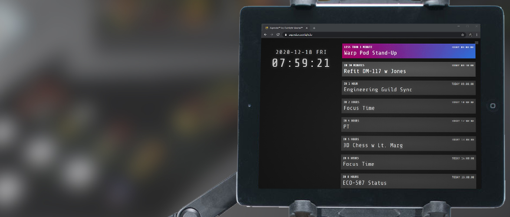
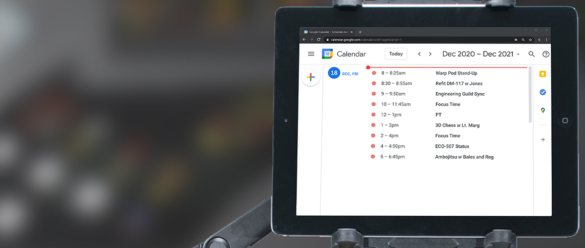
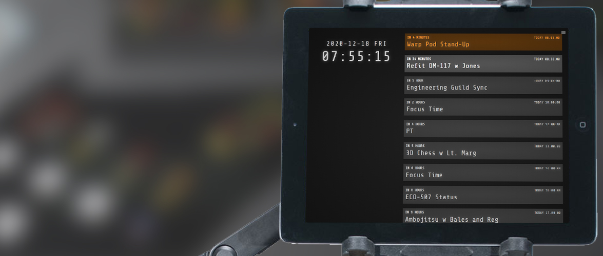

[![[main] deploy](https://github.com/outrightmental/agendar/actions/workflows/main-deploy.yml/badge.svg)](https://github.com/outrightmental/agendar/actions/workflows/main-deploy.yml)

# Agendar<sup>&trade;</sup>

**a Heads-Up Display for being on time.**



In a world of remote meetings, challenges arise between the focus of working without distraction, and showing up on time for events.

It may be especially challenging for a person using a computer to shift gears from deep focus without being a second late.

Assume that I already use [Google Calendar](https://calendar.google.com/) to keep track of the events I will be attending. In order to optimize my chance of success, to cut through the tunnel vision and remain aware of events throughout the day, I mount a tablet on an arm on my desk, dedicated to displaying my agenda:



I tried this, and there was still something lacking. I want the absolute minimum amount of information, tightly centered around these principles:

* Full-screen app has a dark backdrop.
* Events are displayed in monochrome type with minimal decoration.
* Display a local time zone 24-hour clock with seconds.
* Show events from all calendars approaching within the next 24 hours.
* Display event time in terms of how far its beginning occurs from now.
* Within 1 hour of occurring, an event is highlighted in lighter gray.
* Within 10 minutes of occurring, an event is highlighted in yellow, to draw visual attention.
* Within 1 minute of occurring, an event is highlighted with an animated rainbow of all hues, to demand attention.
* Once it begins, an event is highlighted green as visual confirmation of attendance.    
* Consistent progression of visual cues conditions for enhanced punctuality.

Most crucially, there is a security requirement:

* **_Don't share my Google data!_ Use the latest Google APIs to authenticate directly from a web browser, and display events, without touching my data.**

That's exactly what Agendar is!

It's required to have [Google Calendar](https://calendar.google.com/) in order to run the app in your web browser, authenticate directly with the latest Google APIs, and display events, without touching your data:

Within 1 hour of occurring, an event is highlighted in lighter gray, and then within 10 minutes of occurring, an event is highlighted in yellow, to draw visual attention:



Finally, as shown in the main photo, within 1 minute of occurring, an event is highlighted with an animated rainbow of all hues, to demand attention.

It's ***COMPLETELY FREE TO USE*** at **[agendar.outright.io](https://agendar.outright.io)**&mdash; just login with Google to display your Calendar events.

We never access your information!

Your browser will connect directly to Google Calendar in order display upcoming events in a unique way.

Authored by [Nick Charney Kaye](https://charneykaye.com) with &#9829; to meet the heightened strangeness of working from the internet.

Sponsored by [Outright Mental](https://outrightmental.com)<sup>&trade;</sup>

[Privacy](https://privacy.outright.io) and [Terms](https://terms.outright.io) 

## We <em>never</em> access your information!

Your browser will connect directly to Google Calendar in order display upcoming events in a unique way.

## Environment

These environment variables must be set in order to build and run the app. This can by creating an **.env** file in the root of the project, which will be ignored by git-- secrets should Never be checked in to the repository:

```
REACT_APP_GOOGLE_API_KEY=ABC
REACT_APP_GOOGLE_CLIENT_ID=123
```

These environment variables are optional (used only in production)

```
REACT_APP_GOOGLE_ANALYTICS_ID=G-123
```

This project was bootstrapped with [Create React App](https://github.com/facebook/create-react-app).

## Available Scripts

In the project directory, you can run:

### `npm start`

Runs the app in the development mode.\
Open [http://localhost:3000](http://localhost:3000) to view it in the browser.

The page will reload if you make edits.\
You will also see any lint errors in the console.

### `npm test`

Launches the test runner in the interactive watch mode.\
See the section about [running tests](https://facebook.github.io/create-react-app/docs/running-tests) for more information.

### `npm run build`

Builds the app for production to the `build` folder.\
It correctly bundles React in production mode and optimizes the build for the best performance.

The build is minified and the filenames include the hashes.\
Your app is ready to be deployed!

See the section about [deployment](https://facebook.github.io/create-react-app/docs/deployment) for more information.

## Learn More

You can learn more in the [Create React App documentation](https://facebook.github.io/create-react-app/docs/getting-started).

To learn React, check out the [React documentation](https://reactjs.org/).

### Code Splitting

This section has moved here: [https://facebook.github.io/create-react-app/docs/code-splitting](https://facebook.github.io/create-react-app/docs/code-splitting)

### Analyzing the Bundle Size

This section has moved here: [https://facebook.github.io/create-react-app/docs/analyzing-the-bundle-size](https://facebook.github.io/create-react-app/docs/analyzing-the-bundle-size)

### Making a Progressive Web App

This section has moved here: [https://facebook.github.io/create-react-app/docs/making-a-progressive-web-app](https://facebook.github.io/create-react-app/docs/making-a-progressive-web-app)

### Advanced Configuration

This section has moved here: [https://facebook.github.io/create-react-app/docs/advanced-configuration](https://facebook.github.io/create-react-app/docs/advanced-configuration)

### Deployment

This section has moved here: [https://facebook.github.io/create-react-app/docs/deployment](https://facebook.github.io/create-react-app/docs/deployment)

### `npm run build` fails to minify

This section has moved here: [https://facebook.github.io/create-react-app/docs/troubleshooting#npm-run-build-fails-to-minify](https://facebook.github.io/create-react-app/docs/troubleshooting#npm-run-build-fails-to-minify)
